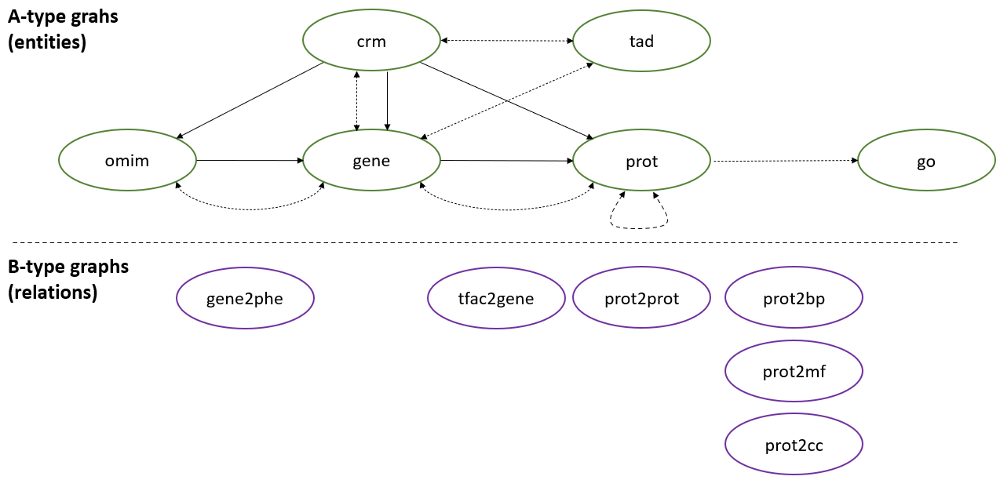
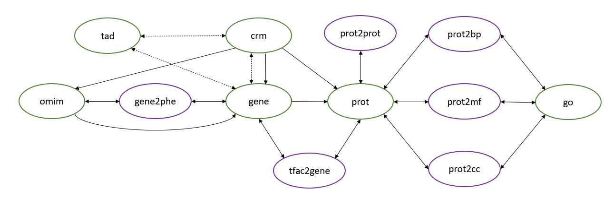
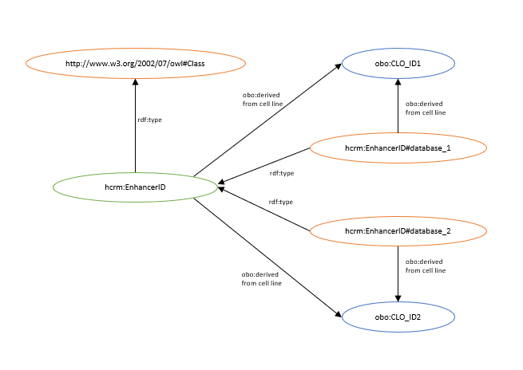
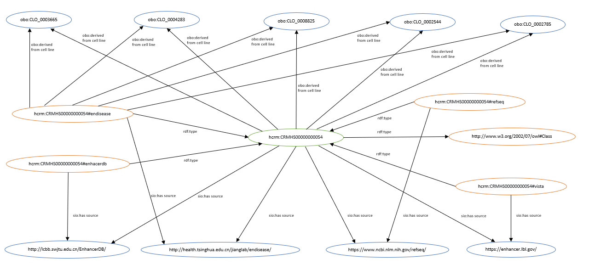
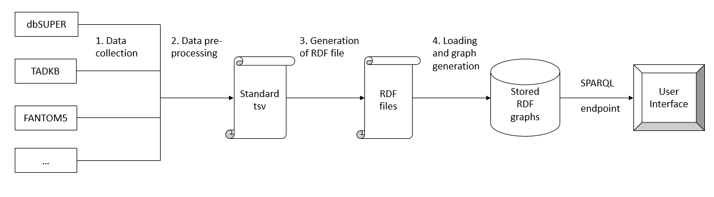

# hBGW

## Introduction
hBGW is a knowledge network based on graphs and RDF triples to query biological information corresponding to Homo sapiens. hBGW is a model that uses semantic web technologies to integrate information from different databases through a model that, by reusing available resources, aims to standardize biological data and improve web interoperability. In addition, the knowledge network includes biological coordinates to allow the development of query strategies that exploit the location of sequences, an aspect that other semantic biological knowledge networks do not usually exploit.

The knowledge network is available through its endpoint [http://ssb4.nt.ntnu.no:10022/sparql](http://ssb4.nt.ntnu.no:10022/sparql) and SPARQL. A short SPARQL [tutorial](./SPARQL_Tutorial.pdf) is available to introduce potencial users to this query language as well as to the use of the knowledge network.

With this contribution we also encourage the community to work on the development of different interoperable knowledge networks to connect domains and allow the development of complex federated queries.

## Structure and content

The generated knowledge network is structured in graphs, being each graph a different information domain. We distinguish two types of graphs in the network: entity graphs and relation graphs. The first ones aim to model different biological entities, while the second ones model relations between different entities.

The knowledge network has the following graphs:
- crm : Cis Regulatory Modules. Currently only enhancer sequences, that increase gene transcription levels.
- tad : Topologically associating domain. Domains of genome structure and regulation.
- gene : Genes.
- prot  - Proteins.
- omim - OMIM ontology (phenotypes, among others).
- go - GO ontology (biological processes, molecular functions and cellular components).
- mi - Molecular Interaction Ontology.
- gene2phe – Relations Genes to phenotypes (omim) .
- tfac2gene – Relations Transcription factors (TF) and their target genes.
- prot2prot - Relations of protein-protein interactions.
- prot2cc - Protein - Celullar components relations.
- prot2bp - Protein - Biological processes relations
- prot2mf - Protein - Molecular functions relations

hBGW is an integrative model in which classes represent entities and instances represent individuals of the classes. Classes collect information from the different databases used as sources of information, so they are useful nodes to extract integrated information. Instances collect the information from each original database, so they are useful nodes for representing the information from each source and its metadata.

## Workflow

The current version of hBGW integrates the BioGateway human classes and instances and domains associated with gene regulation. It also extends the gene graph to include aspects of genome location and provides relations to the [Biolink model](https://biolink.github.io/biolink-model/), focused on the standardization of knowledge graphs.

The following steps were taken to generate the new hBGW domains:
1. Compilation of the [databases used as sources](./images/table_sources.PNG).
2. Preprocessing of files [(Rcodes folder)](./Rcodes).
3. Generation of RDF files [(cisreg folder)](./cisreg). This code requires functions of the project: https://github.com/vlmir/bgw3
4. Loading and generation of graphs in [Virtuoso](https://github.com/openlink/virtuoso-opensource).

## Use Cases

We demonstrate the use of the knowledge network in a set of advanced queries (three use cases) that were not possible in an efficient way until now. Below we provide the files corresponding to the queries and the results obtained:

- Use Case 1: Query - Results
- Use Case 2: Query - Results
- Use Case 3: Query - Results
