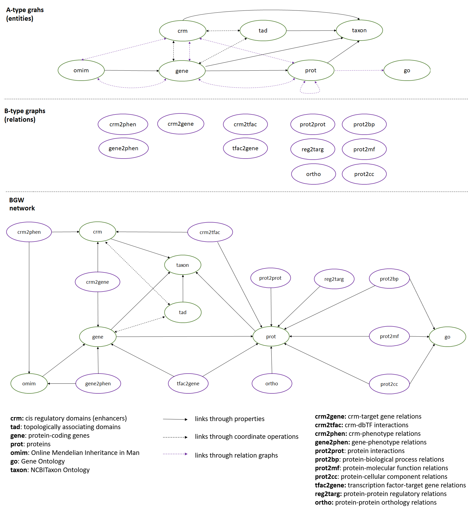
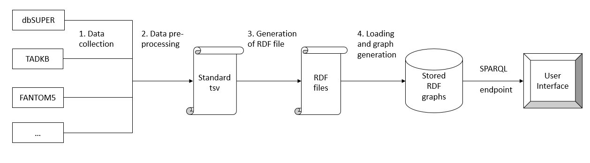
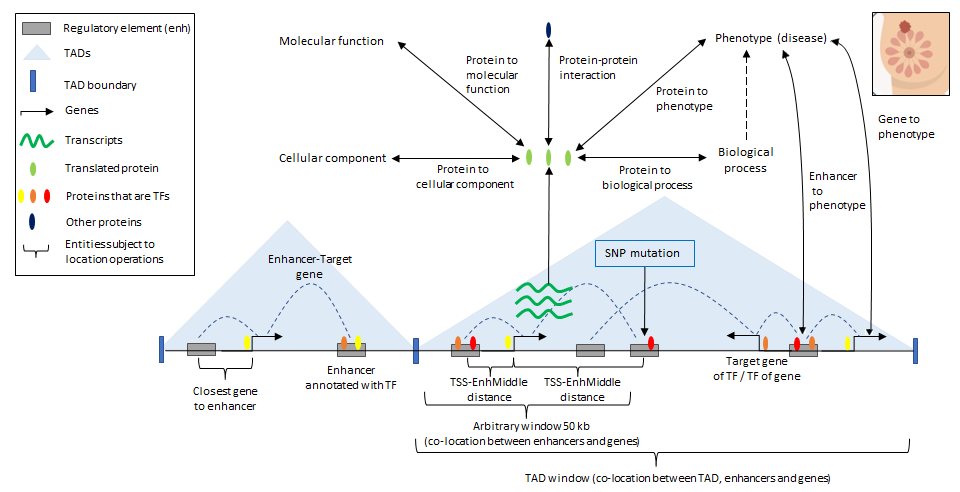

# BioGateway for gene regulation knowledge

## Contents

### Repository Contents

- [Rcodes](./Rcodes/). R code for downloading and preprocessing the original [databases](./images/databases.PNG).
- [schemas](./schemas/). Semantic schemas for modeling and standardizing the representation of knowledge in BioGateway.
- [cisreg](./cisreg/). Go code for serializing preprocessed data into RDF according to the patterns established in the semantic schemas. This code uses as input the results obtained after executing the Rcodes, as well as the mapping files located in the [mappings](./mappings) folder. The resulting graphs are stored in the repository [https://doi.org/10.5281/zenodo.11161303](https://doi.org/10.5281/zenodo.11161303)
- [Use_Cases](./Use_Cases/). SPARQL queries used to test the generated graphs.
- [docs](./docs/). Documents and Supplementary files.


### Readme Contents

- [Introduction](#introduction): Introduction to BioGateway.
- [Structure and content of BGW](#structure-and-content-of-bgw): Structure and Content of BioGateway.
- [Workflow](#workflow): Workflow for reproducing the pipeline.
- [Use cases](#use-cases): Queries to explore the graphs and develop competence questions that address specific use cases.
- [Citation]()


## Introduction
BioGateway is a knowledge network based on RDF graphs to query biological data corresponding to *Homo sapiens* and other organisms. BioGateway uses semantic web technologies to integrate information from different databases through [schemas](./schemas/) that, by reusing available resources, aims to standardize biological data and improve web interoperability. In addition, the knowledge network includes biological coordinates to allow the development of query strategies that exploit the location of sequences, an aspect that other semantic biological knowledge networks do not usually exploit.

The knowledge network is available through the endpoint [https://semantics.inf.um.es/biogateway](https://semantics.inf.um.es/biogateway) and SPARQL. A short SPARQL [tutorial](./docs/SPARQL_Tutorial.pdf) is available to introduce potencial users to this query language as well as to the use of the knowledge network. 

BioGateway is also available in the user-friendly INTUITION app [https://semantics.inf.um.es/intuition/](https://semantics.inf.um.es/intuition/). Tutorial also [here](./docs/INTUITION_Tutorial.pdf). Furthermore, BGW is also available for programmatic access via R and Python libraries (beta versions): [https://github.com/tecnomod-um/RBioGateway](https://github.com/tecnomod-um/RBioGateway) and [https://github.com/tecnomod-um/PyBioGateway](https://github.com/tecnomod-um/PyBioGateway). These tools generate queries automatically, so they eliminate the need to create SPARQL queries manually.

With this contribution we also encourage the community to work on the development of different interoperable knowledge networks to connect domains and allow the development of complex federated queries.

## Structure and content of BGW

The generated knowledge network is structured in graphs, being each graph a different information domain. We distinguish two types of graphs in the network: entity graphs and relation graphs. The first ones aim to model different biological entities, while the second ones model relations between different entities.



The knowledge network has the following [graphs](./docs/BGW_graphs.xlsx):
- crm : Cis Regulatory Modules (CRM). Currently only enhancer sequences, that increase gene transcription levels.
- crm2phen: Relations between CRM and phenotypes.
- crm2gene: Relations between CRM and target genes.
- crm2tfac: Relations between CRM and transcription factors.
- tad : Topologically associating domain. Domains of genome structure and regulation.
- gene : Genes.
- prot : Proteins.
- omim : OMIM ontology (phenotypes, among others).
- go : GO ontology (biological processes, molecular functions and cellular components).
- mi : Molecular Interaction Ontology.
- taxon : NCBI Taxon Ontology.
- gene2phen : Genes - Phenotypes (omim) relations .
- tfac2gene : Relations between transcription factors and their target genes.
- prot2prot : Protein-protein interactions.
- reg2targ : Protein - Protein regulatory relations
- prot2cc : Protein - Celullar components relations.
- prot2bp : Protein - Biological processes relations.
- prot2mf : Protein - Molecular functions relations.
- ortho : Protein-protein orthology relations.  

Network statistics can also be found [here](./docs/BGW_statistics.xlsx).

BioGateway is an integrative model in which classes represent entities and instances represent individuals of the classes. Classes have relations with those entities and data that model the entity. Instances collect the information from each original database, so they have the relations specific of each individual. Therefore, they are useful nodes for representing the information from each source and its metadata.

## Workflow

The current version of BioGateway integrates domains associated with gene regulation (CRM and TADs). It also extends the gene graph to include aspects of genome location and provides relations to the [Biolink model](https://biolink.github.io/biolink-model/) v.3.5.4, focused on the standardization of knowledge graphs.

The following steps were taken to generate the new BGW domains:
1. [Step 1](./Rcodes/): Compilation of the [databases](./docs/images/databases.PNG) used as sources.
2. [Step 2](./Rcodes/): Preprocessing of database files [(Rcodes folder)](./Rcodes).
3. [Step 3](./cisreg/): Generation of RDF files [(cisreg folder)](./cisreg). This code requires functions of the project: https://github.com/vlmir/bgw3. An RDF file fragment corresponding to [enhancers](./docs/RDF_file_examples/CRM.nt) and [TADs](./docs/RDF_file_examples/TAD.nt) is included in the repository as an illustrative example of output.
4. [Step 4](./Use_Cases/): Loading and generation of graphs in [Virtuoso](https://github.com/openlink/virtuoso-opensource).

To run the pipeline, click on each section to access the corresponding Readme and follow the step-by-step instructions.



## Use Cases

We demonstrate the use of the knowledge network in a set of advanced queries (three use cases) that were not possible in an efficient way until now. Below we provide the files corresponding to the queries and the results obtained:

- Use Case 1: [Queries](./Use_Cases/UC1/Queries.txt) - [Results](./Use_Cases/UC1/Results.xlsx).
- Use Case 2: [Queries](./Use_Cases/UC2/Queries.txt) - [Results](./Use_Cases/UC2/Results.xlsx).
- Use Case 3: [Queries](./Use_Cases/UC3/Queries.txt) - [Results](./Use_Cases/UC3/Results.tsv).



Since the databases used as sources vary over time, BioGateway also updates the content of its network.

## Citation

The content of this repository is associated with the publication [https://doi.org/10.1093/nar/gkae566](https://doi.org/10.1093/nar/gkae566):

Mulero-Hernández, J., Mironov, V., Miñarro-Giménez, J. A., Kuiper, M., & Fernández-Breis, J. T. (2024). Integration of chromosome locations and functional aspects of enhancers and topologically associating domains in knowledge graphs enables versatile queries about gene regulation. Nucleic Acids Research, 52(15), e69-e69. https://doi.org/10.1093/nar/gkae566

```
@article{mulero2024integration,
  title={Integration of chromosome locations and functional aspects of enhancers and topologically associating domains in knowledge graphs enables versatile queries about gene regulation},
  author={Mulero-Hern{\'a}ndez, Juan and Mironov, Vladimir and Mi{\~n}arro-Gim{\'e}nez, Jos{\'e} Antonio and Kuiper, Martin and Fern{\'a}ndez-Breis, Jesualdo Tom{\'a}s},
  journal={Nucleic Acids Research},
  volume={52},
  number={15},
  pages={e69--e69},
  year={2024},
  publisher={Oxford University Press}
}
```